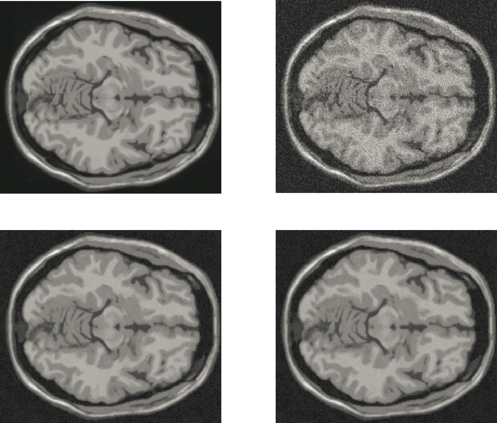

# GPU implementation of NLML MRI Denoising Algorithm

This project describes the first successful GPU acceleration of [NLML(Non local maximum likelihood)](http://ieeexplore.ieee.org/xpls/abs_all.jsp?arnumber=4556617) MRI(Magnetic resonance Imaging) denoising algorithm.<br/>

The results of these experiments were published in the [Springer Journal of Real-Time Image Processing](http://link.springer.com/article/10.1007/s11554-015-0559-6).<br/>

NVidia CUDA was used as the parallel processing framework to accelerate the algorithm performance.

<figure>
	
	<figcaption>
		<ol type="A">
			<li> Ground Truth (60th slice of 3D MR image)</li>
			<li> Image corrupted with Rician noise (&sigma; = 15)</li>
			<li> CPU generated denoised image (PSNR = 29.98)</li>
			<li> GPU generated denoised image (PSNR = 29.98)</li>
		</ol>
	</figcaption>
</figure>

## Prerequisites

1. NVidia Cuda enabled GPU (hardware requirement)
2. Cuda 5.5
3. Microsoft Visual studio 2010
4. Matlab 13a


## Getting Started

These instructions will help you get the project up and running in your local system. Please make sure that the aforementioned prerequisites are fulfilled.

1. In your matlab command prompt:
	- Type 'mex -setup c++' to obtain a list of compilers
	- Change the compiler to Microsoft Visual studio 2010

2. To generate the C++ mex file follow these steps: 
	- Copy the file [diffneigh1_cpu.cpp](Generate%20CPU%20Mex/diffneigh1_cpu.cpp) to any folder
	- In matlab, change the directory to the diffneigh1_cpu.cpp folder's location and run 'mex diffneigh1_cpu.cpp'
	- This will generate the diffneigh1_cpu.mexw64 MATLAB EXECUTABLE FILE
	
3. To generate the Cuda mex file follow these steps:
	- Copy the file [diffneigh1.cu](Generate%20GPU%20Mex/diffneigh1.cu) Cuda C file to any folder
	- Copy these additional files into the target folder: Cuda.lib, Cudart.lib and mexopts.bat
	- In matlab, change the directory to the diffneigh1.cu folder's location and run 'mex diffneigh1.cu'
	- This will generate the diffneigh1.mexw64 MATLAB CUDA EXECUTABLE FILE
	- [Please check this StackOverflow Link for additional info](http://stackoverflow.com/questions/17104884/creating-mex-files-from-cuda-code)
	

## Building and Running the experiments

These instructions will help you to run the experiments in your system.

1. First, load the source file [T1.mat](T1data.mat) in matlab
2. Next introduce some Rician noise into the source image using the [addNoise.m](GPU%20NLML/addNoise.m) file
	```
		%  	noisy = addNoise(groundTruth, standardDeviation);
		%	groundTruth: source image.
		%	standardDeviation: std deviation of noise.
		
		noisy = addNoise(image, 15);
	```
3. Switch your directory to [GPU NLML](GPU%20NLML) and copy the generated diffneigh1_cpu.mexw64 and diffneigh1.mexw64 file into the directory

4. Next, the vector containing the set of non local neighbours for each and every voxel in the noisy image is computed through [NLMLgpu.m](GPU%20NLML/NLMLgpu.m)
	- This generates the Lambda vector using GPU and Cuda Mex file.
	```
		%	gpuArray = NLMLgpu( noisy, searchWinDim, localWinDim);
		% 	noisy: noisy image
		% 	searchWinDim: search window dimensions 
		% 	localWinDim: local window dimensions
		
		% 	searchWinDim: 20x20x20
		%	localWinDim: 3x3x3
		%	TIC & TOC routines measure the execution time to generate the vector
		tic; gpuArray = NLMLgpu(noisy, 20, 3); toc;
	```

5. Similar to step4, this step generates the CPU Lamda Vector [NLMLcpu.m](GPU%20NLML/NLMLcpu.m)
	- This generates the Lambda vector using CPU
	```
		%	cpuArray = NLMLcpu( noisy, searchWinDim, localWinDim);
		% 	noisy: noisy image
		% 	searchWinDim: search window dimensions 
		% 	localWinDim: local window dimensions
		
		% 	searchWinDim: 20x20x20
		%	localWinDim: 3x3x3
		%	TIC & TOC routines measure the execution time to generate the vector
		tic; cpuArray = NLMLcpu(noisy, 20, 3); toc;
	``` 	

6. Finally the denoised image is generated for CPU and GPU generated Lambda Vectors using [NLMLbuild.m](GPU%20NLML/NLMLbuild.m)
	- This generates the final denoised image
	```
		%	cpuDenoised : denoised image generated for cpuArray
		% 	gpuDenoised : denoised image generated for gpuArray
		
		cpuDenoised= NLMLbuild(noisy, cpuArray);
		
		gpuDenoised= NLMLbuild(noisy, gpuArray);
	```
7. The execution time benchmark analysis can be performed for generation of 'cpuArray' vs 'gpuArray'. Our experiments exhibited superior performance of GPU and overall algorithm acceleration.


## Authors

1. Dr. Jeny Rajan
2. Adithya H K Upadhya
  	- [LinkedIn](https://in.linkedin.com/in/adithya-upadhya-2021b582)
  	- [Facebook](https://www.facebook.com/hkuadithya)


## License

This project is licensed under the Apache 2.0 LICENSE - see the [LICENSE.md](LICENSE.md) file for details

## Acknowledgments

The authors thank their family and the open source community.
